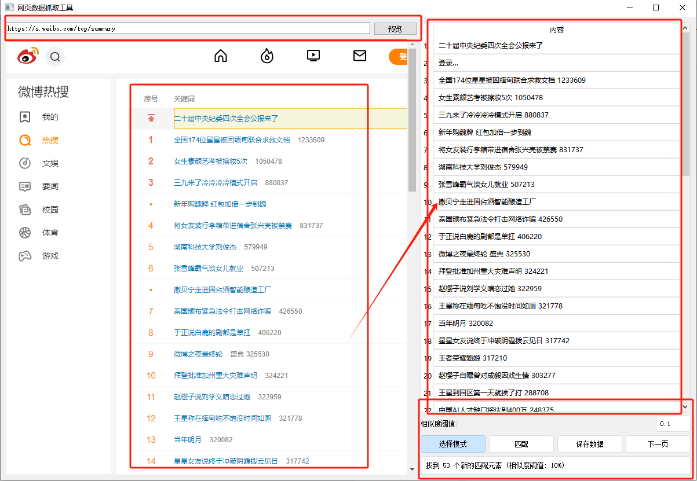

# 网页数据抓取工具

一个基于PyQt5的网页数据抓取工具，提供图形化界面，支持可视化选择和匹配网页元素。



## 功能特点

- 图形化界面，操作简单直观
- 支持网页预览和元素选择
- 实时高亮显示鼠标悬停的元素
- 智能匹配相似元素（基于选择器和类名相似度）
- 支持数据导出（CSV、JSON、Excel格式）
- 支持右键菜单删除已选择的元素
- 状态栏实时显示操作信息
- 支持自定义相似度阈值

## 主要功能

1. **网页预览**
   - 支持输入URL并预览网页内容
   - 内置浏览器引擎，支持现代网页技术
   - 自动补全URL协议（http/https）

2. **元素选择**
   - 可视化选择模式
   - 鼠标悬停时自动高亮目标元素
   - 点击选择感兴趣的元素
   - 自动提取元素文本内容和选择器信息

3. **智能匹配**
   - 基于选择器路径的相似度匹配
   - 基于元素类名的相似度匹配
   - 可调节的相似度阈值（默认0.67）
   - 自动去重和排序

4. **数据管理**
   - 表格化展示选中的元素
   - 支持删除已选择的元素
   - 鼠标悬停显示完整信息
   - 多种格式导出数据

## 使用方法

1. **启动程序**
   ```bash
   python main.py
   ```

2. **输入网址**
   - 在地址栏输入要抓取的网页URL
   - 点击"预览"按钮加载网页

3. **选择元素**
   - 点击"选择模式"按钮启用选择功能
   - 鼠标移动到目标元素上会自动高亮
   - 点击选中需要的元素

4. **匹配相似元素**
   - 设置相似度阈值（0-1之间）
   - 点击"匹配"按钮查找相似元素
   - 自动添加到数据表格中

5. **导出数据**
   - 点击"保存数据"按钮
   - 选择保存格式（CSV/JSON/Excel）
   - 选择保存位置并确认

## 系统要求

- Python 3.6+
- PyQt5
- PyQtWebEngine
- pandas

## 安装依赖

```bash
pip install -r requirements.txt
```

## 项目结构

```
demo019/
├── main.py              # 主程序
├── element_selector.py  # 元素选择器模块
├── requirements.txt     # 依赖项
├── images/             # 图标和图片资源
└── README.md           # 项目说明
```

## 注意事项

1. 首次运行时确保已安装所有依赖包
2. 部分网站可能限制自动化访问，需要遵守网站的使用政策
3. 建议根据实际需求调整相似度阈值
4. 选择模式下，确保鼠标在网页预览区域内操作

## 开发计划

- [ ] 支持下一页自动抓取
- [ ] 添加更多元素匹配规则
- [ ] 支持数据预处理和过滤
- [ ] 添加批量导出功能
- [ ] 支持自定义CSS样式

## 许可证

MIT License 